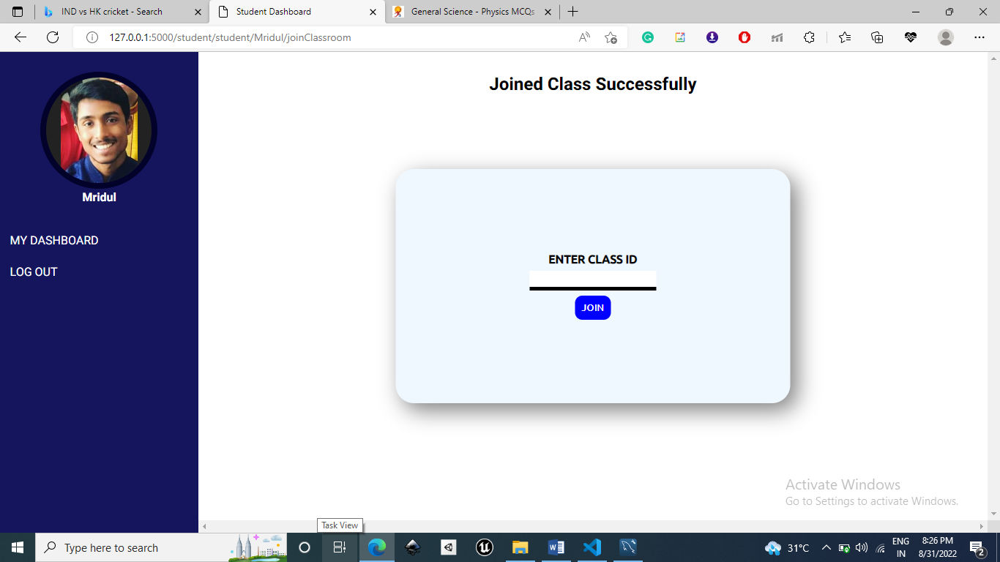

<h1> Online Quiz Examination With Proctor System </h1>
  

<h3>Index Page 1</h3>

  

<h3>Index Page 2</h3>

  

<h3>Option To register</h3>

  

<h3>Student Registration Page</h3>

  

<h3>Teacher Registration Page</h3>

  

<h3>Teacher Dashboard</h3>

  

<h3>Teacher Dashboard Create Quiz</h3>

  

<h3>view Quizzes Of Particular Classroom</h3>

  

<h3>Teacher Dashboard View Class</h3>

  

<h3>Delete Classroom</h3>

  

<h3>View Exam Report</h3>

  

<h3>View Proctor Report</h3>

  

<h3>view Quizzes Particular Classroom</h3>

  

<h3>View Report Of Students Given Exam</h3>

  

<h3>Student Classroom Dashboard</h3>

  

<h3>Enter Class ID Join Class</h3>

  

<h3>On Successfully Joining The Class</h3>

  

<h3>Student Performing Quiz</h3>

  

<h3>Student Viewing Quiz</h3>

  

<h3>Student Performing Quiz</h3>

  
